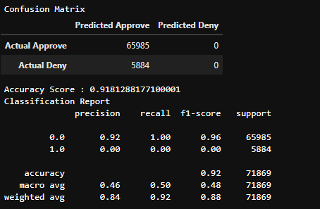

# Home_Credit_Risk

## Description

Many people have a hard time obtaining loans to lack of credit history. This allows for some financial institutions to lend to these people but also takes advantage of them. The purpose of this project is to take alternative data to predict peoples repayment abilites.

### Step 1: Load Data/Data Cleaning

The first step I took to this challenge was to review the data on kaggle, I breifly looked at the different files and saw how large they were. I decided that once I was to load in the data I needed to get rid of some of the missing data already to help with the run time. I decided to build a fucntion that I would take 10% of the missing values and drop them. I also noticed that there were gender columns. It is illegal to use gender as a factor when lending, i dropped this column as well. 

I took at look at each of the datasets and needed to figure out which column I was going to eventually use to merge them into one dataset. Most of them shared the same colum SK_ID_CURR but a couple did not but they had other columns that I could use. After going through each of the datasets I noticed that there were duplicates on the column that I was merging on, I started the drop the duplicates after I merged and went through the rest of the datasets doing this. I also checked a few other columns along the way. Once I finished mergeing all the datasets I wanted a list of the column names. I noticed in the list of columns there ID columns that were not needed for this analysis so I dropped them from the training and test sets. I then filled in any null values that were a float or an integer with the mean value. There were still null values but in categorical columns, I looked to see how many null values were in each column and decided to drop them. 

### Step 2: Feature Engineering

Once I got the dataset cleaned I wanted to take a closer look at the categorical columns. I noticed that a couple of the unique values in the training columns did not match the unique values in the testing set. To solve this I decided to use Onehot encoding, because this technqiue will fill in the missing value. For example if I had two datasets with a column "gender" and the value in one set  was "boy" and the other one had "boy", "girl", if we encoded it with get_dummies it would just use those values and encode. Where one hote encoder would encode the column with "boy" and "girl", then when it moves to the other set it notices that it does not have a "girl" value. It knows the "girl" value is needed so it fills it in but assigns it a 0. This allows the two data sets to keep its shape when it is time to run a machine learning model. Once my data sets have been coded I have to join the encoded set to the original set and drop the orginal columns and keep the encoded ones. Once I dropped the columns I checked for null values and dropped those as well. 

### Step 4 Building ML Models

The data set has now been cleaned and encoded, now I had to split the data into training and testing sets. I split the data by assinging X to the training set and y to the testing set, I then did a train test split on the X and y. I then scaled my data using the StandardScaler. After this I built my first model to get an idea of how it would perform. Based on my confusion matrix I can see that it is very unbalanced. To make sure I take a look at the number of 1 and 0 in my target column to see how off they are. When I do this I can see that the 0s out number the 1s which tells me I have a very unbalanced dataset. My first approach is to use SMOTE, this will allow my values to be balanced. When I evaluted the next model which I implemented SMOTE I can see that I got better results this time around. However I want to keep experimenting to see what else I can produce. I tried using using a different scaler, I used the MinMax Scaler. this produced similar results as the previous model. I then used SelectKBest, Chi2 and SMOTE to obtain the most important features from the datasets and ran this through a random forest classifier. I also used the random undersample along with the SelectKBest and chi2 to obtain different results. For me to use SelectKBest and Chi2 I needed to use the MinMaxScaler as this would produce positive values. If I had use the Standard Scaler I would have run into errors. I ran both model and evaluted each model. The overall accuracy score of SelectKBest paired with SMOTE is better then the undersampler. But the percision, recall and f1-score were higher for value 1.

### Model 1: Basic Model

### Model 2: SMOTE Resampling

### Model 3: MinMax_SMOTE

### Model 4: SMOTE SelectKBest

### Model 5: Undersampling SelectKBest

### Next Steps:

If I were to continue with this project I would try using a different classification model. I would also go back to the data cleaning section and see what else could be cleaned. 
